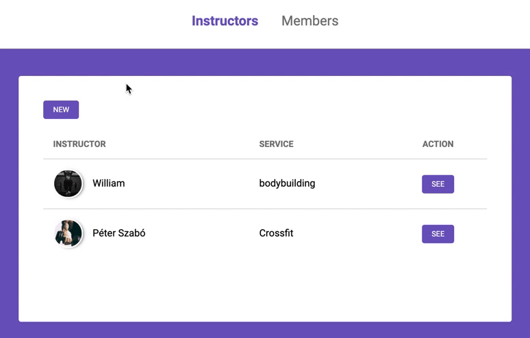
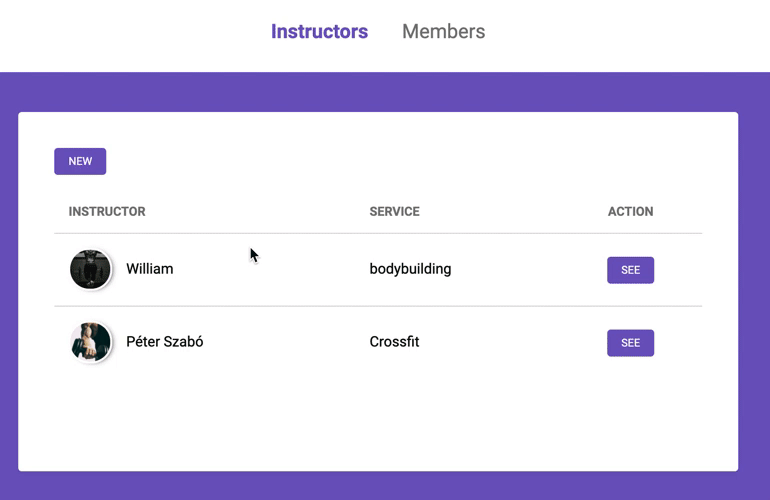

<h1 align="center">
    
</h1>

<h3 align="center">
  Gym Manager
</h3>

<p align="center">

  <a href="/LICENSE" >
    
  </a>

  <a href="https://www.linkedin.com/in/felipe-pontes-dev/" >
    
  </a>
</p>

<p align="center">
  <a href="#rocket-about-this-repo">About this repo</a>&nbsp;&nbsp;&nbsp;|&nbsp;&nbsp;&nbsp;
  <a href="#gear-installing-and-running">Installing and Running</a>&nbsp;&nbsp;&nbsp;|&nbsp;&nbsp;&nbsp;
  <a href="#memo-license">License</a>
</p>

## :rocket: About this repo

This web site was develop as a challenge for the Rocketseat Launchbase Bootcamp 4, and uses the basics building blocks of the web: HTML, CSS and JavaScript to create a gym manager site. The back-end was made with Node.js and Nunjucks as a view engine.

<p align="center">
  
  
</p>

## :gear: Installing and Running

### Installing

Make sure that you are at the project root directory and run the following command on your terminal

```bash
$ npm install
```

### Local server

Run this command

```bash
$ npm start
```

After that, the following message should be logged at your terminal

```bash
Server running on port 5000
```

Now open on your browser [http://localhost:5000/](http://localhost:5000/).

Enjoy!

## :memo: License

This Project is under MIT License. Read the [LICENSE](./LICENSE) file for more details.